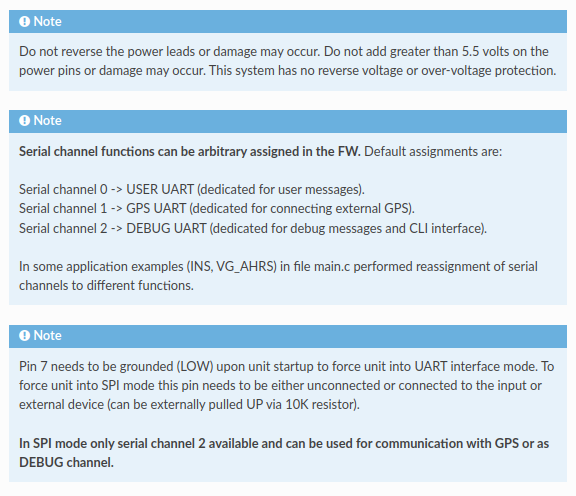

# Módulo GPS-IMU.

## Representação 2d e 3d da placa

  
  

## Elementos principais para a confecção da placa:

* GPS e IMU - OpenIMU300ZI.

  
  

## Connector e tabela de informações sobre a função de cada pino do IMU.

    
    
    

## Observações quanto a alimentação, conexão das portas seriais e o seletor de interface (pin_7 - comunicação UART/SPI).

* Esquematico do regulador de tensão fornecido pelo texas instruments no datasheet do LM1117.

## Problema do carrinho não visivel no gazebo

